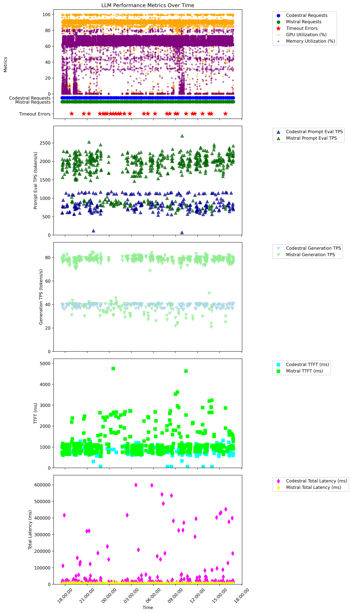

# Basic performance characterization
For all tests, the LLM was served from a single workstation with the following hardware:
- Intel(R) Core(TM) i7-8700K CPU @ 3.70GHz
- 48.0 GB RAM
- Samsung EVO 960 NVMe drive
- nVidia 3090 FE (thermal padding, but no OC)
    - Driver Version: 560.94
    - CUDA Version: 12.6
## Series 1: Manual, Single User Baseline
- Method: Manual execution and stats collection with each test separated by 30 seconds or more
- Observations: 
    - Significant variability was observed over a sample of 5 tests for each series. This is likely due to caching. Therefore first test results are shown independently of others in the series.

### RAG Test Results
- Prompt: How many calories are in a Quiznos Classic Italian sub?
- Generation Model: Mistral-Nemo-Instruct-2407-Q4_K_M.gguf

### Non-Cached Performance (First Test)
| Metric                 | Value              |
|------------------------|--------------------|
| Prompt Eval TPS        | 2033.53 tokens/s   |
| Generation TPS         | 68.43 tokens/s     |
| GPU Utilization (%)    | 91%                |
| Memory Utilization (%) | 64%                |

#### Cached Performance (Subsequent Tests, 4 Samples)
| Metric                 | Mean Value         | Standard Deviation | Coefficient of Variation (%) | 95% Confidence Interval   | Reliable? |
|------------------------|--------------------|--------------------|------------------------------|---------------------------|-----------|
| Prompt Eval TPS        | 13.96 tokens/s     | 19.37              | 138.8                        | [-40.37, 68.29]           | No        |
| Generation TPS         | 68.59 tokens/s     | 0.72               | 1.0                          | [67.59, 69.59]            | Yes       |
| Response Latency (TTFT)| 280.74 ms          | 56.89              | 20.3                         | [190.22, 371.26]          | No        |
| Response Latency (Total)| 1050.07 ms       | 320.02             | 30.5                         | [540.92, 1559.22]         | No        |
| GPU Utilization (%)    | 68.8%              | 27.29              | 39.7                         | [34.92, 102.68]           | No        |
| Memory Utilization (%) | 53.0%              | 22.96              | 43.3                         | [25.77, 80.23]            | No        |

### Marketing Assistant Test Results
- Prompt: Create a 100-word marketing blurb for a new sandwich called the 'Spicy Italian Stallion' at Bread & Butter Sandwich Shop. Highlight its bold flavors, fresh ingredients, and appeal to adventurous eaters. Use a fun, energetic tone to attract customers for a weekend special.
- Generation Model: Mistral-Nemo-Instruct-2407-Q4_K_M.gguf

#### Non-Cached Performance (First Test)

| Metric                 | Value              |
|------------------------|--------------------|
| Prompt Eval TPS        | 1038.79 tokens/s   |
| Generation TPS         | 71.08 tokens/s     |
| Response Latency (TTFT)| 379.29 ms          |
| Response Latency (Total)| 2306.56 ms        |
| GPU Utilization (%)    | 86%                |
| Memory Utilization (%) | 77%                |

#### Cached Performance (Subsequent Tests, 4 Samples)

| Metric                 | Mean Value         | Standard Deviation | Coefficient of Variation (%) | 95% Confidence Interval   | Reliable? |
|------------------------|--------------------|--------------------|------------------------------|---------------------------|-----------|
| Prompt Eval TPS        | 42.33 tokens/s     | 71.63              | 169.2                        | [-71.64, 156.30]          | No        |
| Generation TPS         | 71.20 tokens/s     | 0.22               | 0.3                          | [70.85, 71.55]            | Yes       |
| Response Latency (TTFT)| 202.73 ms          | 88.76              | 43.8                         | [61.51, 343.95]           | No        |
| Response Latency (Total)| 1842.87 ms       | 139.61             | 7.6                          | [1620.76, 2064.98]        | Yes       |
| GPU Utilization (%)    | 89.0%              | 7.39               | 8.3                          | [77.23, 100.77]           | Yes       |
| Memory Utilization (%) | 73.75%             | 3.86               | 5.2                          | [67.61, 79.89]            | Yes       |

### Code Assistant Test Results
- Prompt: Write a Python function for Bread & Butter Sandwich Shop to calculate the total price of a customer’s order, including a 10% discount for orders over $50 and a 7% sales tax. The function should take a list of items (each with a name and price) as input and return the final price. Include error handling for invalid inputs and comments for clarity.
- Generation Model: Codestral-22B-v0.1-Q3_K_M.gguf

#### Non-Cached Performance (First Test)

| Metric                 | Value              |
|------------------------|--------------------|
| Prompt Eval TPS        | 551.63 tokens/s    |
| Generation TPS         | 37.10 tokens/s     |
| Response Latency (TTFT)| 819.39 ms          |
| Response Latency (Total)| 12463.57 ms       |
| GPU Utilization (%)    | 91%                |
| Memory Utilization (%) | 62%                |

#### Cached Performance (Subsequent Tests, 4 Samples)

| Metric                 | Mean Value         | Standard Deviation | Coefficient of Variation (%) | 95% Confidence Interval   | Reliable? |
|------------------------|--------------------|--------------------|------------------------------|---------------------------|-----------|
| Prompt Eval TPS        | 18.02 tokens/s     | 13.03              | 72.3                         | [-2.72, 38.76]            | No        |
| Generation TPS         | 37.40 tokens/s     | 0.41               | 1.1                          | [36.74, 38.06]            | Yes       |
| Response Latency (TTFT)| 91.49 ms           | 66.41              | 72.6                         | [-14.17, 197.15]          | No        |
| Response Latency (Total)| 11905.43 ms      | 1104.82            | 9.3                          | [10147.66, 13663.20]      | Yes       |
| GPU Utilization (%)    | 92.5%              | 2.38               | 2.6                          | [88.71, 96.29]            | Yes       |
| Memory Utilization (%) | 64.25%             | 2.63               | 4.1                          | [60.06, 68.44]            | Yes       |

## Series 2: Automated, identical query, threaded and batched
- Automated
    - Using [script](./automated_performance_testing/automated_performance_test.py)
    - Execute that same prompt query with three simultaneous threads, for twenty iterations

### Test Results
| Metric                 | Mean Value         | Standard Deviation | Coefficient of Variation (%) | 95% Confidence Interval   | Reliable? |
|------------------------|--------------------|--------------------|------------------------------|---------------------------|-----------|
| Prompt Eval TPS        | 2161.36 tokens/s | 519.90 | 24.1 | [2133.00, 2189.72] | No |
| Generation TPS         | 75.40 tokens/s | 4.58 | 6.1 | [75.15, 75.65] | Yes |
| Response Latency (TTFT)| 306.64 ms | 138.76 | 45.3 | [299.08, 314.21] | No |
| Response Latency (Total)| 2009.31 ms | 500.31 | 24.9 | [1929.24, 2089.37] | No |
| GPU Utilization (%)    | 88.17% | 13.71 | 15.5 | [85.53, 90.82] | No |
| Memory Utilization (%) | 59.98% | 15.86 | 26.4 | [56.92, 63.04] | No |

## Series 3: Automated - Simulated multi-user behavior across three workspaces with unique prompts
This [test script](./automated_performance_testing/automated_performance_test-series3.py) is intended to simulate nine users, having bursty behavior patterns (modeled as exponential distribution of inter-request delays, constrained between 10 - 300 seconds), sending 740 unique prompts, split evenly across the three assistants. 

Given that a single prosumer GPU is not expected to handle multiple concurrent requests, the following affordances were made during this test.
- Requests were sent in series, rather than truly being concurrent
- A overly generous timeout of 15 minutes (900 seconds) was set to allow for requests to complete during times of significant contention, so that we can find other potential bottlenecks and performance issues in the system. It is understood that this amount of delay would be unreasonable for interactive user experience. Actual delay can be seen in the results graph below.

System limitations affecting performance
- Anything LLM lacks a fair access policy feature. There is no mechanism in place to ensure fair access where requests are affected by the queuing delays of other requests.
- Despite AnythingLLM API request timing out client side, our test script has no feature to kill the request on the backend (llama-server), and so it will tie up resources until completed

### Parameter changes
As a result of running this test multiple times, multiple system parameters have been tuned to alleviate bottlenecks
- Increased Codestral and anything LLM container CPUs to two, to accommodate them occasionally exceeding 100% CPU
- Increased Codestral container's context size to 4096, making sure that the context window setting in frontend (anything llm) and backend (llama.cpp) match
- Reduced number of parameter flags passed to llama.cpp to simplify configuration, using more default configurations

### Final test results
Results from the Series3 test [script](./automated_performance_testing/automated_performance_test-series3.py) were analyzed and plotted using a [matplotlib script](./automated_performance_testing/plot_series3_data.py). The result follows.

| **Category**                     | **Metric**                          | **Value**                     |
|----------------------------------|-------------------------------------|-------------------------------|
| **Request Statistics**           | Total Requests                     | 741                           |
|                                  | Successful Requests                | 713                           |
|                                  | Failed Requests                    | 28                            |
| **Performance Metrics**          | Response Latency (Total)           | 50,648.23 ms (Std Dev: 146,444.37 ms) |
|                                  | Response Latency Percentiles (10th, 50th, 90th) | 1,557.95 ms, 2,982.06 ms, 121,281.22 ms |
|                                  | GPU Utilization                    | 69.44% (Std Dev: 38.54%)      |
|                                  | Memory Utilization                 | 51.68% (Std Dev: 28.68%)      |
| **Codestral Metrics (poc-llama-cpp-codestral-1)** | Prompt Eval TPS                    | 842.33 tokens/s (Std Dev: 194.38) |
|                                  | Response Latency (TTFT, approximated) | 813.37 ms (Std Dev: 214.03)   |
| **Mistral Metrics (poc-llama-cpp-mistral-1)** | Prompt Eval TPS                    | 1,799.37 tokens/s (Std Dev: 455.49) |
|                                  | Response Latency (TTFT, approximated) | 1,167.65 ms (Std Dev: 584.77) |
|                       