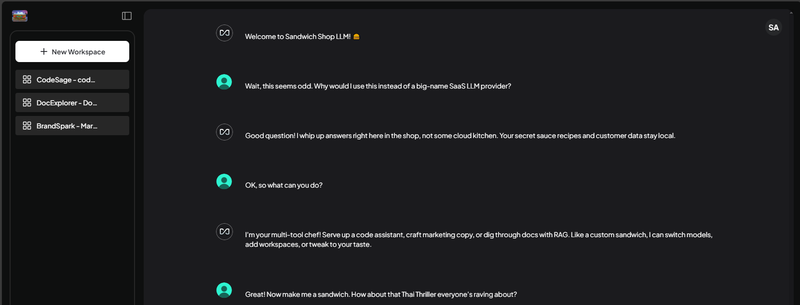
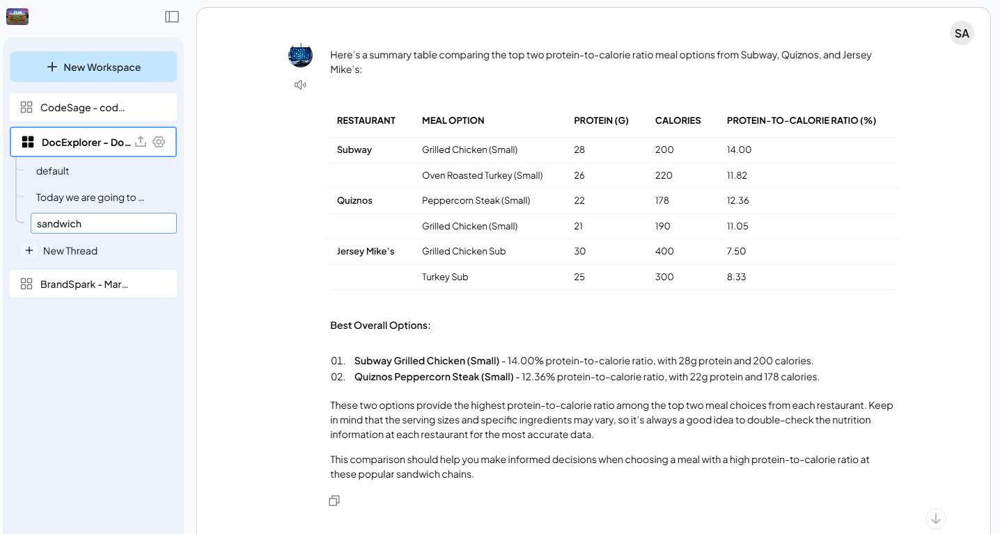
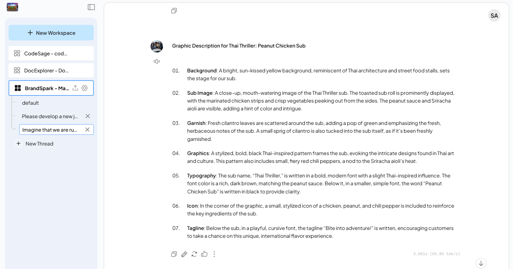
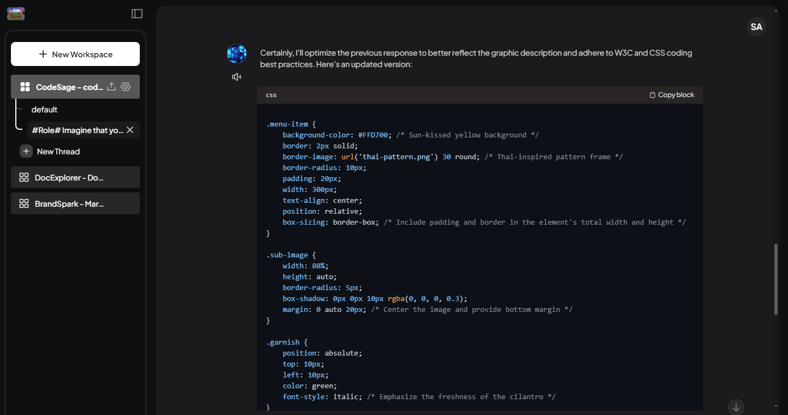
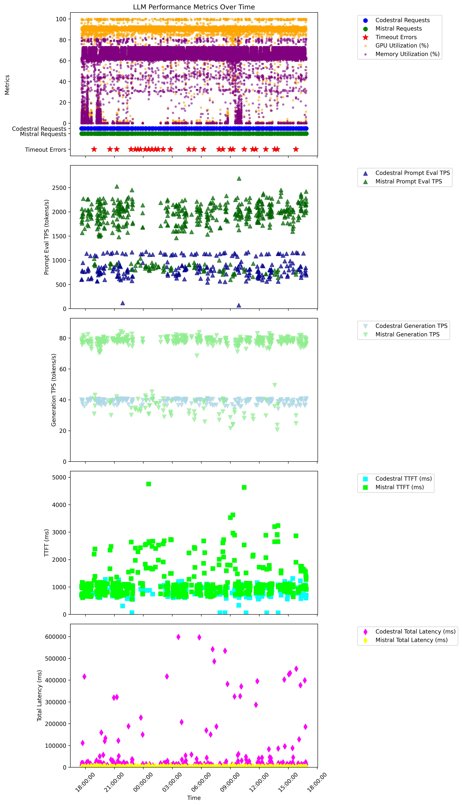

# Readme
Contemporary LLMs require data center-scale hardware to support their video memory and bandwidth requirements. However, hosting cleverly quantized LLMs on local, commodity GPUs may be feasible for specific use cases. This is of particular interest from the standpoint of democratizing LLMs, as well as, maintaining responsibility for information security and data sovereignty. 

This proof of concept explores the practicality of serving LAN accessible, docker composable, personalized LLM assistants, using a Windows PC with nvidia RTX GPU. We invite you to assess its performance and utility for your needs.

## Demo - Sandwich Shop LLM
With a nod to the [Sock Shop microservices](https://github.com/microservices-demo/microservices-demo) demo, we created a Sandwich Shop example. The owner of a bespoke sandwich shop wishes to host their own LLM assistants to use in the business, while minimizing the risks that their secret recipes could be leaked through third party data processing risk.


This demo features three assistants:
- **DocExplorer** - Document RAG Chat, e.g. to research files we have on the competition.


- **BrandSpark** - Marketing Assistant, e.g. to generate copy for our next signature item


- **CodeSage** - Code Assistant, e.g. to generate the shop's brochure website


## Key Features
- Supports Windows 10/11 and Nvidia RTX GPU
- Docker composable for easy of deployment / changes
- Hosting multiple custom assistants using multiple models on one prosumer GPU 
- LAN accessible WebUI and API 
- Software bill of material [SBOM](SBOM.md) to support integrity
- [Step-by-Step installation instructions](Installation.md)
- [Example API scripts](API_Example/API_Example_readme.md) to chat with assistants programmatically
- Basic performance testing has been done to characterize expected performance

## Component Overview
- Hardware: Windows 10/11 PC with nVidia RTX GPU
    - Running WSL2.0 and Docker Desktop
    - Serves all processing and storage
        - (Optional): fast disk, e.g. NVMe

- [AnythingLLM](https://github.com/Mintplex-Labs/anything-llm) Frontend:
    - Docker container (mintplexlabs/anythingllm).
    - Three workspaces (coding, document RAG, and marketing assistants)
        - Suggested system prompts with instructions and basic guardrails

- Local [Llama.cpp](https://github.com/ggml-org/llama.cpp) inference services (Backend):
    - Docker containers (llama.cpp:full-cuda)
    - Loads models from /usr/share/models
    - One container per model

- LLM Model Files:
    - Public models from Huggingface
    - Static in /usr/share/models on NVMe-backed WSL2 virtual disk
    - Two models selected for balanced performance with ~20 GB video memory capacity limit
        - Codestral-22B-v0.1-Q3_K_M
            - code assistant
        - Mistral-Nemo-Instruct-2407-Q4_K_M 
            - Document RAG chat
            - Marketing Assistant

- Networking Services:
    - Docker port forwarding
    - Windows firewall whitelists ingress to LLM from LAN
    - Windows hosts file for LAN FQDNs.

## Performance Overview
Overall the demo seems to work reasonably well for small numbers of users in tasks that are not mission critical and have a human in the loop.
- Consistent behavior was observed in: 
    - Maximum use of available GPU without significant tweaks
    - Generation tokens per second (TPS)
        - Mistral-Nemo, 12B: ~ 80 TPS
        - Codestral-22B, 22B: ~ 40 TPS
- Expected behavior was observed in:
    - Key value (or other) cache leads to noticeable performance improvements for repeated tasks, as in document RAG chat
    - It is possible to overwhelm the GPU with concurrent use
- During soak testing, most requests received responses within a few seconds. However during times of contention, responses could exceed 10 seconds, minutes, or even timeout (see chart).

### Soak Test Scatter Plot


Please review our [Performance](Performance.md) details for numerical results and test methodology.

## Known Issues and Limitations
- Scalability is constrained by GPU as shown in performance testing.

- There is no mechanism in place to ensure fair access where requests are affected by the queuing delays of other requests.

- Despite Anything LLM's project having a great [readme on docker](https://github.com/Mintplex-Labs/anything-llm/blob/master/docker/HOW_TO_USE_DOCKER.md), I was unable to get programmatic configuration working with their standard container. Therefore we used a workaround in a number of places.
    - Click-ops is needed on fresh installation as described in our [Step-by-Step installation instructions](Installation.md) to provision LLM providers, users, and workspaces.
    - Additional workarounds were needed related to configuration items that failed to persist after container reset
        - Passed via ENV in docker-compose.yml
            - JWT_SECRET (generated in shell and passed as ENV var)
            - VECTOR_DB
        - Reconfigure LLM providers via click-ops after every Anything LLM restart. If you consistently use the same providers, the other settings should continue to work OK.

- Our installation procedure steps for downloading models was performed in a privileged (root) WSL context. This sets up a permissions conflict that blocks Anything LLM container user "uid=1000 (anythingllm)" from downloading models (e.g. during first invocation of OCR in document RAG) to the same folder. The following temporary workaround was used to mitigate this issue.
    ```
    cd /usr/share/
    # Mark verified model files as read-only to avoid unintentional changes
    sudo find /usr/share/models -type f -exec chmod 644 {} \;
    # Make the models folder world writable. 
    sudo chmod -R 777 /usr/share/models
    ```

## Basic Troubleshooting
- Check GPU Utilization ```nvidia-smi``` in Windows command prompt
- Restart containers, in order, using docker-compose in WSL bash
    ```
    docker-compose down
    # workaround currently needed before starting: export JWT_SECRET=$(openssl rand -base64 32)
    docker-compose up -d
    docker ps -a
    ```
- Check health endpoints specified in [docker compose file](docker-compose.yml) from host and from inside containers
- Example curl to llama.cpp inference service
    ```
    curl -X POST http://localhost:8002/v1/completions \
        -H "Content-Type: application/json" \
        -d '{"prompt": "Please generate a C sharp program to print the first 100 numbers in the fibonacci sequence", "max_tokens": 500}'
    ```

## Future Work
- Build a custom Anything LLM container image to configure programmatically 

- Secure all the things
    - If its still needed, pass JWT_SECRET to docker compose from vault (e.g. hashicorp vault, 1Password CLI, etc.)
    - Setup SSO rather than local auth on Anything LLM
    - Setup WSL to run as non-root
        - download models as uid=1000
    - TLS and auth between inference and anything LLM, anything LLM and proxy, proxy and user
    - review model training for bias and guardrails
    - LLM firewall (before and after LLM) for DLP, mitigate jailbreak, etc.
    - harden containers
        - run llama containers as non-root
        - review cap and other conditions that may lead to container escape
        - scan for missing patches with DockerScout / Trivy
    - Add scanning of all SBOM assets for threats
 - Scale demo to small K8 cluster with two GPU nodes, e.g. using helm
 - Performance characterization with industry standard tools, such as the following. 
    - NVIDIA GenAI-Perf (end-to-end benchmarking)
    - TensorRT-LLM (optimized inference)
    - Ragas (RAG evaluation)
- Consider SMOL agents as an alternative for performing specific business tasks locally